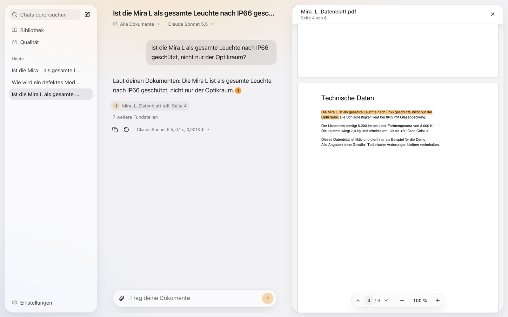
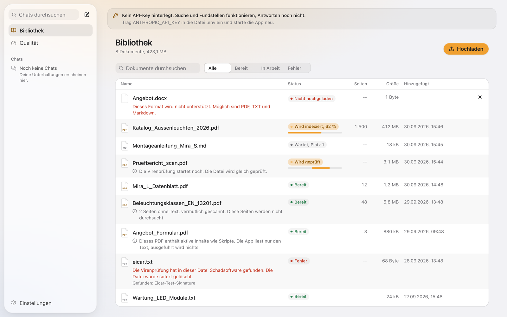

# Siteco Document Chat

[](https://github.com/luca-sktn/Siteco/actions/workflows/ci.yml)

Upload PDFs, text and Markdown files, ask questions in German or English, and get streamed answers whose claims link to the exact sentence in the original file, highlighted in the PDF. It runs locally with `docker compose up`: parsing, OCR, malware scan, embeddings and search stay on your machine, only the question and the best passages go to Claude.



## Quick start (5 minutes)

Prerequisites: Docker with Compose v2 and about 4 GB of free memory (backend up to 2 GB, virus scanner about 1 GB). Works on arm64 and amd64.

    git clone https://github.com/luca-sktn/Siteco.git && cd Siteco
    docker compose up --build

Open http://localhost:3000. The first build downloads dependencies, the web font and the local embedding model (about 400 MB) and verifies that the model works offline; allow a few minutes. After that the app runs offline, except for calls to the Claude API.

- **Without a key** (nothing to configure): upload and search work. A question shows the matching passages instead of an answer ("search-only mode") and the app says how to add a key.
- **With a key:** paste it in Settings > Models (checked with a free call, used from the next question, no restart), or set `ANTHROPIC_API_KEY` in `.env` (`cp .env.example .env`) and restart. The default model is Claude Sonnet 5.5, switchable per message (Haiku 4.5, Opus 5.5).
- **Full chat without any key:** put `LLM_PROVIDER=fake` in `.env`. A deterministic stand-in answers with the first real sentence of the best passage and cites it, so the whole path (retrieval, streaming, citations, highlighting, persistence) works offline. All automated tests and CI use it; CI never calls Claude.
- Only the web app is published, on `127.0.0.1:3000`. The backend is reachable only inside the Compose network.
- Every upload is checked by ClamAV first. The scanner starts with the signatures shipped in its image (seconds on a current Mac, up to a minute on slower machines); until it answers, uploads wait with the status "Checking".

## Demo path for reviewers (3 minutes)

1. Library: drop in a PDF. The status goes from "Checking" (malware scan) to "Reading" to "Ready". A file of the wrong type is rejected with a clear message.
2. New chat: ask a concrete question ("Which protection rating does the luminaire have?"). The answer streams in and each claim carries a numbered chip.
3. Click a chip. The PDF opens on the cited page with the cited sentence highlighted. Esc closes it.
4. Ask a follow-up ("and its weight?"). It is rewritten for search using the chat history.
5. Open the details under the answer: model, tokens, cost, timings, the passages that were sent.
6. Try Compare (two models side by side).
7. Optional: `claude mcp add --transport http docchat http://localhost:3000/api/mcp` and search the library from Claude Code.



## What is built, mapped to the case brief

| Case brief | Where |
|---|---|
| Upload | Library with drag and drop and progress, or straight into a chat (only there, or also into the library); import from a link with SSRF protection; PDF, TXT, Markdown, HTML (read as text, never rendered); up to 1 GB and 5000 pages per file; scanned pages via OCR (Tesseract, German and English); ClamAV scan before anything is stored |
| Process | pypdfium2 in its own process with timeouts, sentence aware chunking (about 400 tokens, never across pages), local Granite multilingual embeddings, LanceDB index with vectors and BM25, batches so a 1500 page catalog stays at flat memory |
| Retrieve | Hybrid search (vectors plus BM25 with German stemming, reciprocal rank fusion), follow-up rewriting, source selection with a per-document cap |
| Answer | Claude with `search_result` blocks and native citations, SSE streaming, stop, retry, multichat with history, document scope per chat |
| Optional: rich rendering and artifacts | Markdown with tables and code, safe by construction (no HTML, no images); tables and code open in a side panel |
| Optional: citation highlighting | Chips open the PDF on the page with line rectangles around the cited sentence; text files highlight the passage; scans use OCR word positions |
| Optional: multi-model | Model per message, side by side compare with timings and cost, server side fallbacks shown openly |
| Optional: retrieval evaluation | 32 questions, 7 configurations, numbers below, CI gate |
| Beyond the brief | German and English UI, settings, onboarding, a catalog of stable error codes, GDPR tools (export, delete, retention), MCP server, desktop app for macOS and Windows |

## Architecture

```
Browser or desktop window (localhost:3000)
  -> Next.js 16 container (127.0.0.1 only), own streaming proxy for /api
       -> FastAPI container (internal network only, one worker)
            SQLite   /data/app.db     truth: documents, chats, messages, preferences, usage
            LanceDB  /data/lancedb    index: chunks, vectors, BM25 (one writer)
            files    /data/uploads    originals under UUID names
            Granite embeddings and Tesseract are in the image, offline
       -> clamd container (internal network), scans every upload
  -> Anthropic API (optional, key only in the backend)
```

Backend layers are enforced by import-linter: `api` (thin HTTP), `services` (use cases), `domain` (pure rules and ports); `adapters` implement the ports and only `core/container.py` wires them. The frontend is feature folders behind `index.ts` with types generated from the OpenAPI contract. More in [docs/architecture.md](docs/architecture.md).

## The ten decisions that matter

| Topic | Picked | Rejected | Why |
|---|---|---|---|
| Citations | Claude `search_result` blocks with native citations, mapped by chunk id | The model writes `[1]` itself | Exact cited sentences, and documents stay data instead of instructions |
| Retrieval | Hybrid: vectors plus BM25, rank fusion | Vectors only | Exact codes like IP66 and cross-language questions both work (see evaluation) |
| Embeddings | IBM Granite 97M multilingual, local, in the image | API embeddings, bge-m3 | Strong German, Apache 2.0, CPU friendly, offline, only one key needed |
| Index | LanceDB embedded, SQLite as the truth | Qdrant, Chroma | No extra service; search only sees documents SQLite marks `ready` |
| PDF parsing | pypdfium2 in a separate process | PyMuPDF (AGPL), Docling (needs torch) | Line rectangles for highlighting, killable on a hostile file |
| Streaming | Own SSE over POST and an own Next.js proxy | Vercel AI SDK, `rewrites()` | Full control; `rewrites()` buffered the stream for 20 s in a spike |
| Model | Sonnet 5.5 at low effort, choice per message | One hard wired model | Quality and cost fit reading comprehension; the app shows cost per answer |
| Chunking | Page, paragraph, sentence, with a context header | Semantic chunking | No measured gain, and sentences are the citable unit |
| Answer safety | No images, no HTML, links only http(s) and mailto, static CSP | Sanitizing afterwards | A prompt injection cannot exfiltrate through a rendered image |
| Uploads | Raw body per file, quarantine until ClamAV says clean | Multipart, scan later | Bytes are counted while reading; nothing unscanned is ever served |

Every decision with its rejected option and reason: [docs/decisions.md](docs/decisions.md).

## Evaluation

Retrieval, measured with the production pipeline on 71 pages (two EU regulations in German and English plus three fictional datasheets) and 32 hand checked questions (28 answerable). Method and per category results: [docs/evaluation.md](docs/evaluation.md).

| Configuration | Hit@1 | Hit@5 | In sources | p50 |
|---|---|---|---|---|
| **Hybrid, German stemmer (default)** | 0.46 | 0.89 | **0.93** | 11 ms |
| Vectors only | 0.46 | 0.82 | 0.89 | 11 ms |
| BM25 only, German stemmer | 0.57 | 0.79 | 0.86 | 2 ms |

"In sources" means a right page is among the 8 passages Claude actually receives. Honest reading: hybrid is the only configuration without a blind spot (BM25 collapses on cross-language questions, vectors lose exact codes), but it does not put the right page first more often than BM25 does. The set is small and built as a regression guard, not a benchmark; CI fails if the default drops below the measured numbers. A reranker is the measured next step for the first place.

Generation quality (Haiku vs Sonnet vs Opus, judged by Claude) is prepared but not run yet, because it needs an API key and costs a few dollars:

    RUN_LIVE=1 ANTHROPIC_API_KEY=... make eval-generation

It writes `eval/results/generation.json`.

## Testing

| What | How | Count |
|---|---|---|
| Backend: domain, adapters, services, API, integration | pytest with real SQLite and LanceDB, fake embedder and fake LLM, a real uvicorn for streaming and disconnects | 666 |
| Frontend: reducers, markdown safety, citations, components, i18n | Vitest and Testing Library | 468 |
| Desktop app | Vitest | 87 |
| Browser E2E | Playwright against the Docker stack with the fake model and in no-key mode, traces as CI artifacts | 4 specs, 2 stack modes |
| Retrieval quality | Eval gate in CI with the real embedding model | 32 questions |
| Malware, privacy, injection | EICAR against real clamd, forensic erasure check on disk, prompt injection fixture, no third party requests | inside the suites above |
| Architecture and contract | import-linter, ESLint boundaries, OpenAPI and generated type drift | CI |
| Fresh clone | `./scripts/fresh-clone-test.sh` (no `.env`) and `FRESH_ENV=fake ./scripts/fresh-clone-test.sh` (with `.env`), run on arm64 | release |

CI (`.github/workflows/ci.yml`) runs backend, frontend, desktop, eval gate, E2E and the Docker build; actions are pinned to commit SHAs and the token is read only. Details: [docs/testing.md](docs/testing.md).

## Security and privacy

Threat model in short: one user on their own machine, hostile documents, and hostile web pages talking to `localhost`. Measures: the API key only in the backend; no host port for the backend; a mandatory `X-Requested-With` header plus origin check against cross-site requests; upload checks (size, magic bytes, UUID names), a parser process with timeouts, PDF active content detection; ClamAV with quarantine; documents only as `search_result` data with a policy in the system prompt, no tools, no images or raw HTML in answers; a static CSP with `connect-src 'self'`; containers run as non-root with a read-only root filesystem and all capabilities dropped. Details, including the review of the MCP exception: [docs/security.md](docs/security.md).

GDPR: privacy by design, not a certificate. Only the question and the top passages leave the machine, never the name; no third parties in the browser (self-hosted font, no analytics); transparency in onboarding and settings; deletion of file, chunks, vectors and cited snippets; export of all chats; optional automatic deletion after 30, 90 or 365 days, chosen in Settings > Data.

Known limit, stated plainly: deleting a document removes the file, the vectors and the quoted snippets (a test searches the disk for them). If the model copied wording into an answer, that answer text stays until the chat is deleted. The privacy page in Settings says so.

Telemetry: none. ONNX Runtime turned out to send telemetry to Microsoft and to crash at exit on macOS; it is switched off in code and image and a test guards it. Hugging Face, Next.js and Electron telemetry are off too.

Deliberately not built, and why: login and multi-user (a single local workspace by design), EU inference (needs a contract; the production path is Claude on Bedrock Frankfurt), a nonce based CSP (the App Router streams inline scripts; the static policy is documented), content disarm for PDFs (the app detects and shows active content instead).

## MCP server

Claude Code and Claude Desktop can search your library: `claude mcp add --transport http docchat http://localhost:3000/api/mcp`. Two read only tools, `list_documents` and `search_documents`, optional bearer token. Details in [docs/mcp.md](docs/mcp.md).

## Environment variables

| Variable | Required | Default | Purpose |
|---|---|---|---|
| `ANTHROPIC_API_KEY` | no | empty | Claude API key, read only by the backend container; a key entered in Settings > Models wins |
| `ANTHROPIC_WORKSPACE_ID` | no | empty | Only for keys of an organization's default workspace that Anthropic refuses without one; can also be entered in Settings > Models next to the key |
| `APP_PORT` | no | `3000` | Host port of the web app |
| `INTERNAL_TOKEN` | no | empty | Optional shared secret between web app and backend |
| `MCP_TOKEN` | no | empty | Optional bearer token for the MCP endpoint (see docs/mcp.md) |
| `LOG_LEVEL` | no | `INFO` | Backend log level |
| `OCR` | no | `on` | Tesseract (German and English) reads scanned pages; `off` leaves them unsearchable |
| `FULL_CONTEXT_MAX_TOKENS` | no | `150000` | Documents in a chat's scope up to this size (about four characters per token) are sent to Claude completely, page by page, and cached for follow-up questions; larger scopes use search (page and exact term lookups included). `0` always searches |
| `LLM_PROVIDER` | no | `anthropic` | `fake` answers without Claude (tests, demo) |

## Development

    make dev-api     # clamd from compose.dev.yaml (127.0.0.1:3310), then FastAPI with hot reload on 127.0.0.1:8000
    make dev-web     # Next.js dev server on localhost:3000
    make test        # backend and frontend tests
    make lint        # linters, type checks and architecture boundaries
    make api-types   # regenerate contracts/openapi.json and the TypeScript types
    make fresh-clone # prove a clean clone starts without .env
    make e2e         # browser E2E against the Docker stack (fake model, then no key)

Scanned PDFs are read by Tesseract inside the Docker image. For local development without Docker install it once: `brew install tesseract tesseract-lang`. Without it the library says so on documents that have pages without text.

## Desktop app (macOS and Windows)

A native window instead of a browser tab: double-click the app, it starts what it needs and opens Siteco Document Chat. Optional; the official way stays `docker compose up`. Needs Node 22.12 or newer to build and Docker Desktop to run.

    npm install            # root scripts plus desktop/ (downloads Electron, about 130 MB)
    npm run app:build      # unsigned .app for arm64 and x64 in desktop/release
    npm run app:install    # copies it to ~/Applications/Siteco Document Chat.app
    npm run app:build:win  # Windows installers (NSIS) for x64 and arm64 in desktop/release

What happens on a double-click:

1. If the app already answers on `http://localhost:3000` (identity check on `/api/health/live`), the window opens at once.
2. Otherwise a small splash finds the docker CLI, starts Docker Desktop if needed, runs `docker compose up --detach --build` in the project folder and waits for the app. The first start builds the images (a few minutes); later starts take seconds.
3. If something is missing (Docker not installed or not starting, port taken, compose error), the splash says what to do and offers "Erneut versuchen". "Details" shows the last lines of output.

Quitting leaves the containers running, so the next start is instant. "Dienste beenden" in the app menu runs `docker compose stop` and quits; your data stays in the Docker volumes.

The project folder is the repository the app was built from. If it moves, the app asks once for the folder (it must contain this project's `compose.yaml`) and remembers it. Settings live in `~/Library/Application Support/Siteco Document Chat/config.json` (`port` changes the port, passed to compose as `APP_PORT`).

The app is built and opened on the same Mac, so it carries no quarantine flag and Gatekeeper opens it without a prompt. It is only ad-hoc signed; handing it to others would need a Developer ID signature and notarization.

The window moves by its top strip (about 52 px across sidebar, chat header and side panel); every control in it stays clickable, and a double click maximizes the window (macOS follows the Dock setting for double clicks on a title bar).

Security: context isolation, sandbox and no Node.js in the page; the page sees only `{ isDesktop, platform, window }`, where `window` holds five window commands (minimize, maximize or restore, close, maximized state, app menu). The main process accepts them only from the app window's main frame on the app origin. Navigation stays on the app origin, popups are denied, http(s) links open in the default browser after validation, permission requests are denied (except clipboard writes for the copy buttons), and requests to any other origin are blocked. Electron fuses are hardened (no `ELECTRON_RUN_AS_NODE`, no `NODE_OPTIONS`, encrypted cookies, code only from the integrity-checked `app.asar`). Crash reports stay on the Mac; there is no telemetry. Docker is called with `execFile` and fixed argument lists, never through a shell.

### Windows 10 and 11

`npm run app:build:win` builds a per-user installer (`Siteco-Document-Chat-Setup-<version>-x64.exe`, an arm64 one and one for both) that installs without admin rights to `%LOCALAPPDATA%\Programs` and adds Start menu and desktop shortcuts. It builds on a Mac too. Settings live in `%APPDATA%\Siteco Document Chat\config.json`.

- Needs Windows 10 22H2 (build 19045) or Windows 11, and Docker Desktop with WSL 2. The splash checks this when Docker is missing or does not start and says what to do: update Windows, turn on virtualization (Intel VT-x or AMD-V) in the BIOS or UEFI, or run `wsl --install` as administrator.
- The app finds `docker.exe` in Docker Desktop's folder under Program Files (also on another drive) or `%LOCALAPPDATA%\Programs`, starts `Docker Desktop.exe` when the engine is off and runs the same `docker compose` command as on a Mac.
- The window has no Windows title bar: the app draws its own buttons (menu, minimize, maximize or restore, close) in its 32 px title bar, which also moves the window, snaps and maximizes on double click. Windows 11 rounds the corners natively; Windows 10 keeps square corners with the normal shadow, snap and edge resizing.
- Windows has no app menu bar: settings, view, about, "Dienste beenden" and quit are in the menu button at the left of the title bar (the window buttons are the native ones, with Snap Layouts); the shortcuts (Ctrl+, Ctrl+R, Ctrl+plus and minus) work as usual.
- Not signed: SmartScreen asks once ("More info", "Run anyway").

Honest limit: the Windows build, its platform logic and the title bar are covered by unit tests and checked in a Chrome simulation of the Windows shell; I could not run the app on a real Windows 10 or 11 machine.

For development:

    npm run dev            # backend with hot reload, next dev and the Electron window
    npm run app            # Electron against the Docker stack, with the same startup as the .app
    npm run test:desktop   # unit tests (Vitest)
    npm run test:desktop:e2e  # Electron smoke test against a running app (skips if none)

## Next steps

1. A cross-encoder reranker for the first place (hybrid reaches 0.46 Hit@1, BM25 alone 0.54).
2. Contextual retrieval (a short document summary in each chunk) and a measured long-context baseline against retrieval for small libraries.
3. Map-reduce summaries of whole large documents (today the answer says when it only saw the relevant parts).
4. Run the generation eval with a key and publish the model comparison.
5. Authentication and multi-user with per-user libraries, then a server deployment.
6. EU inference through Claude on AWS Bedrock in Frankfurt, plus the organizational GDPR steps (DPA, transfer assessment, records of processing).
7. Signed and notarized desktop builds with an updater.

## How I worked with AI

Claude Code was my pair programmer and my reviewer. It wrote most of the code test first, and separate review passes checked each work package against the specification, the red-team notes and the error catalog. The decisions, the scope, the design taste and the verification were mine: I chose the stack and the trade-offs, rejected what did not hold up (for example `rewrites()` for streaming, PyMuPDF, a hard wired model), ran the fresh-clone and forensic deletion checks, and found the telemetry and the flaky test by reading logs and failures instead of trusting green runs.
