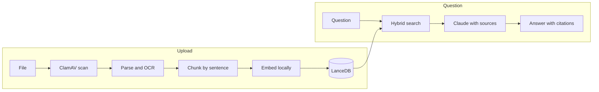
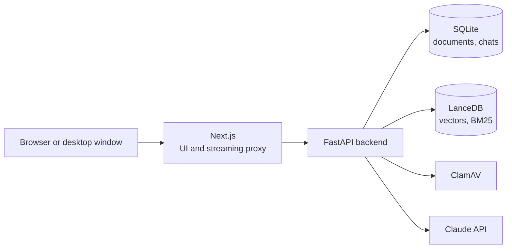

<div align="center">

# Document Chat

**Ask your documents. Get answers you can check.**

Upload PDFs and text files, ask in German or English, and every answer points to the exact sentence it comes from.

[](https://github.com/helpful-luca/Siteco/actions/workflows/ci.yml)


[Getting started](#getting-started) · [Features](#features) · [How it works](#how-it-works) · [Decisions](#key-decisions) · [Tests](#tests) · [Roadmap](#roadmap)

<br>


</div>

<br>

## Highlights

<table>
  <tr>
    <td width="33%" valign="top">
      <b>Answers with proof</b><br>
      Every claim carries a numbered source. One click opens the PDF on the right page with the sentence highlighted.
    </td>
    <td width="33%" valign="top">
      <b>Private by default</b><br>
      Parsing, OCR, embeddings and search run locally. Only the question and the relevant passages go to Claude.
    </td>
    <td width="33%" valign="top">
      <b>Built for real documents</b><br>
      Catalogs up to 5000 pages, scanned pages with OCR, tables and product codes like IP66.
    </td>
  </tr>
  <tr>
    <td valign="top">
      <b>German and English</b><br>
      Ask in one language about a document in the other. UI in both languages.
    </td>
    <td valign="top">
      <b>Safe uploads</b><br>
      Every file is scanned by ClamAV before it is used, and parsed in an isolated process.
    </td>
    <td valign="top">
      <b>Browser or desktop</b><br>
      Runs in the browser or as a native window on macOS and Windows.
    </td>
  </tr>
</table>

## Getting started

Pick one of three ways. All of them use Docker.

| | Command | You get |
|---|---|---|
| **Docker** | `docker compose up --build` | The app at http://localhost:3000 |
| **Desktop app** | `npm install && npm run app` | The same app in its own window |
| **Development** | `npm install && npm run dev` | Backend and frontend with hot reload |

On first start an onboarding asks for language, appearance and your name. Then add your Claude API key under **Settings > Models**, and you are ready. Without a key, upload and search already work.

<details open>
<summary><b>Docker</b></summary>
<br>

Requires Docker with Compose v2 and about 4 GB of free memory.

```sh
git clone https://github.com/helpful-luca/Siteco.git
cd Siteco
docker compose up --build
```

- The first build takes a few minutes and about 3.5 GB of disk. Later starts take seconds.
- The key can also go into `.env`: `cp .env.example .env`, set `ANTHROPIC_API_KEY`, run `docker compose up -d`.
- Port 3000 taken? `APP_PORT=3001 docker compose up --build`
- Stop with `docker compose down`. Your documents and chats stay in Docker volumes.

</details>

<details>
<summary><b>Desktop app</b></summary>
<br>

Requires Docker and Node 22.12 or newer.

```sh
npm install
npm run app
```

The app starts Docker Desktop if needed, runs the same stack and opens a window. The first start downloads Electron (about 130 MB). Closing the window keeps the containers running, so the next start is instant. Installers for macOS and Windows: [desktop/README.md](desktop/README.md).

</details>

<details>
<summary><b>Development</b></summary>
<br>

Requires Python 3.12 with [uv](https://docs.astral.sh/uv/), Node 22.12 or newer, `make` and Docker. Stop the Docker stack first (`docker compose stop`), since both use port 3000.

```sh
npm install
npm run dev
```

Starts the virus scanner in Docker, the backend on port 8000, Next.js on port 3000 and the desktop window. The first run downloads the embedding model (about 400 MB). A key in `.env` is used here as well. For scanned PDFs outside Docker: `brew install tesseract tesseract-lang`.

</details>

## Features

<p>
  
  
  
</p>
<p>
  
  
</p>
<p>
  
  
</p>

| Case brief | What is built |
|---|---|
| **Upload** | PDF, TXT, Markdown, HTML by drag and drop or link; up to 1 GB and 5000 pages per file; ClamAV scan first |
| **Process** | pypdfium2 in its own process, OCR for scans, sentence-aware chunks, local embeddings (IBM Granite), LanceDB |
| **Retrieve** | Hybrid search: vectors and BM25 with German stemming, combined by rank fusion |
| **Answer** | Claude with native citations, streamed, with stop, retry and chat history |
| **Rich rendering** | Markdown with tables and code; tables and code open in a side panel |
| **Citation highlighting** | Exact line positions in PDFs, passages in text files, OCR word positions for scans |
| **Multiple models** | Haiku, Sonnet or Opus per message, plus side-by-side comparison with cost and timings |

Also included: light and dark mode, command palette (⌘K or Ctrl K), data export and deletion, desktop app for macOS and Windows.

## How it works





- **Backend:** layers `api`, `services`, `domain` and `adapters`; import-linter checks the boundaries in CI.
- **Frontend:** feature folders; API types are generated from the OpenAPI contract.
- **Network:** only the web app is published, on 127.0.0.1. The backend and the scanner stay inside Docker.

More in [docs/architecture.md](docs/architecture.md).

## Key decisions

| Topic | Chosen | Rejected | Why |
|---|---|---|---|
| Citations | Claude `search_result` blocks with native citations | The model writes `[1]` itself | Exact cited sentences; documents stay data, not instructions |
| Retrieval | Hybrid: vectors and BM25 | Vectors only | Finds exact codes like IP66 and works across languages |
| Embeddings | IBM Granite multilingual, local | API embeddings, bge-m3 | Good German, runs offline on CPU, only one API key needed |
| Index | LanceDB embedded, SQLite as source of truth | Qdrant, Chroma | No extra service; search only sees finished documents |
| PDF parsing | pypdfium2 in a separate process | PyMuPDF (AGPL), Docling (needs torch) | Line positions for highlighting; a broken file can be stopped |
| Streaming | Own SSE endpoint and Next.js proxy | Vercel AI SDK, Next.js `rewrites()` | Full control; `rewrites()` buffered the stream |
| Model | Claude Sonnet 5.5, switchable per message | One fixed model | Good quality and cost for reading; cost shown per answer |
| Chunking | Page, paragraph, sentence | Semantic chunking | Sentences are what gets cited and highlighted |
| Answer safety | No images or HTML in answers, strict CSP | Sanitising afterwards | A prompt injection cannot leak data through an image |
| Uploads | One file per request, quarantine until scanned | Multipart, scan later | Size is checked while reading; nothing unscanned is used |

All 42 decisions with reasons: [docs/decisions.md](docs/decisions.md).

## Tests

<table>
  <tr>
    <td align="center"><b>944</b><br>Backend</td>
    <td align="center"><b>491</b><br>Frontend</td>
    <td align="center"><b>113</b><br>Desktop</td>
    <td align="center"><b>2</b><br>End-to-end runs</td>
  </tr>
</table>

```sh
make test   # backend, frontend and desktop tests
make lint   # linters, type checks, architecture boundaries
make e2e    # browser tests against the Docker stack
```

- **Backend:** pytest with real SQLite and LanceDB. **Frontend and desktop:** Vitest. **End to end:** Playwright against the Docker stack, once with a stubbed model and once without a key.
- Tests replace Claude with a test double, so they never call the paid API.
- CI runs everything and builds the images on amd64 and arm64.
- `make e2e` needs a browser once: `cd frontend && npx playwright install chromium`.

## Configuration

Nothing is required. All options are in [.env.example](.env.example).

| Variable | Default | Purpose |
|---|---|---|
| `ANTHROPIC_API_KEY` | empty | Claude API key; a key set in the app takes precedence |
| `APP_PORT` | `3000` | Port of the web app |
| `OCR` | `on` | Read scanned pages; `off` skips them |
| `LOG_LEVEL` | `INFO` | Backend log level |

## Security and privacy

| | |
|---|---|
| **API key** | Stays in the backend; the backend is not reachable from outside Docker |
| **Requests** | Only to localhost; changes also need a custom header and the app's own origin |
| **Uploads** | Size and file type checked, parsed in an isolated process, scanned by ClamAV |
| **Prompt injection** | Documents go to Claude as data; answers cannot load images or run HTML |
| **Tracking** | No analytics, no third-party requests, bundled telemetry turned off |
| **Deletion** | Removes file, vectors and quoted snippets; optional automatic deletion after 30, 90 or 365 days |

Details and known limits: [docs/security.md](docs/security.md).

## Roadmap

| Next | What | Why |
|---|---|---|
| **Hosting** | Deploy as a web service with managed storage and EU inference (Claude on AWS Bedrock, Frankfurt) | Use it without Docker on your own machine |
| **Accounts** | Registration, login and a private library per user, later shared team libraries | One instance for many people |
| **Choose your model** | Plug in other providers and local models next to Claude | Pick by cost, speed or data policy |
| **Quality checks** | A test set of questions with measured retrieval and answer quality, a reranker where it helps | Improve with numbers, not by feel |
| **Mobile app** | iOS and Android apps that sync documents and chats across devices | Ask your documents on the go |
| **Large documents** | Summaries over whole catalogs, not only the best passages | Questions like "summarize all 1500 pages" |
