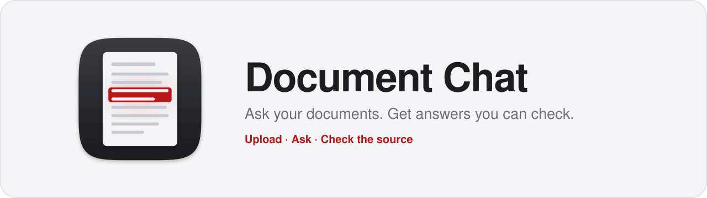
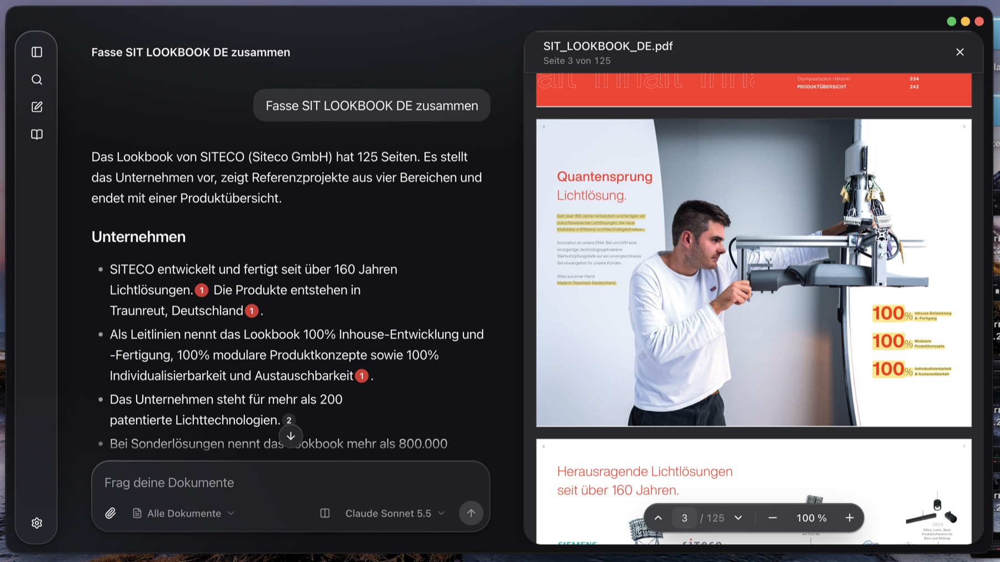
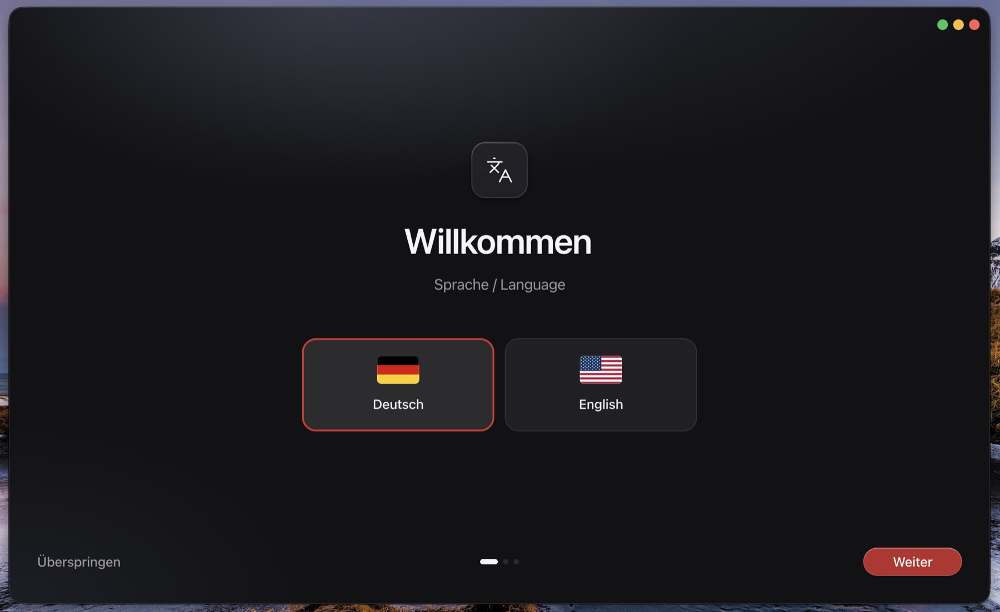
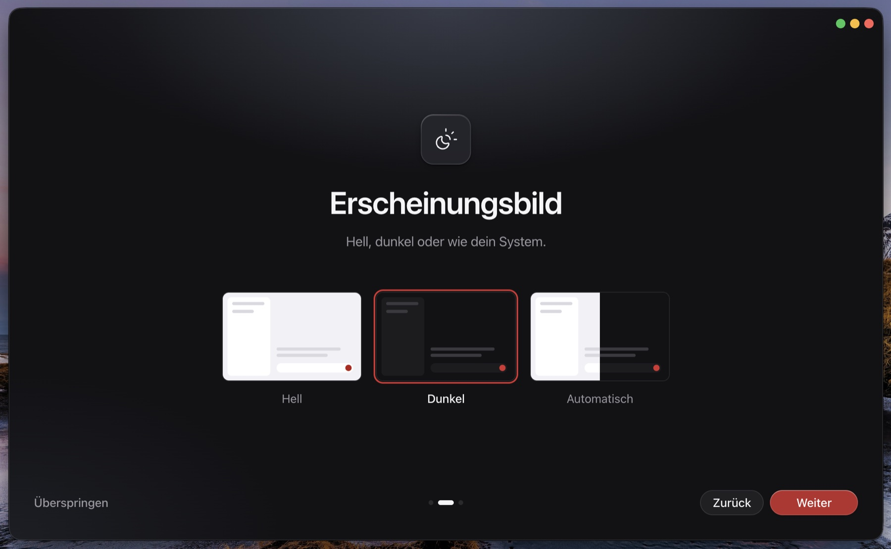
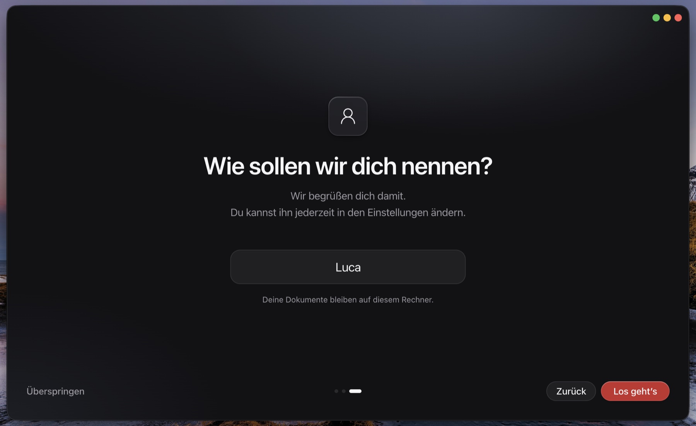
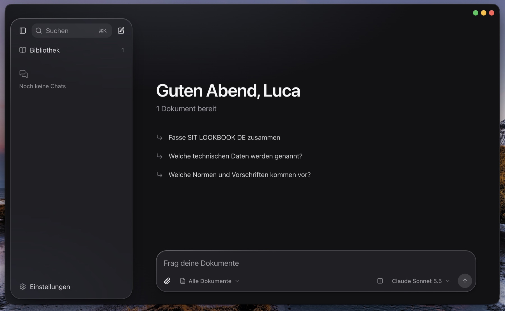
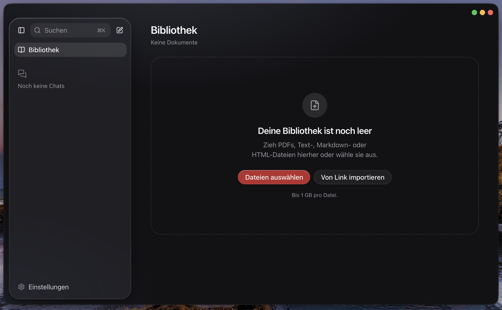
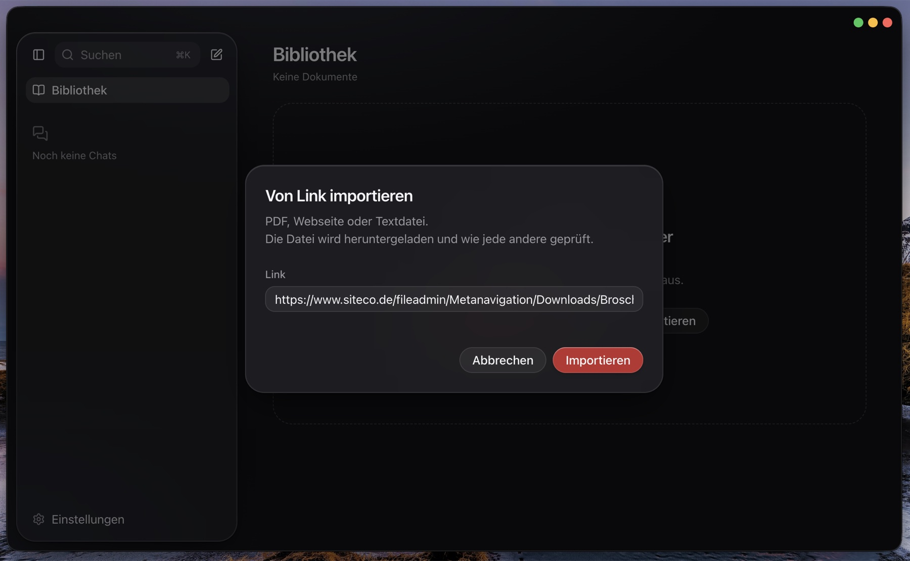
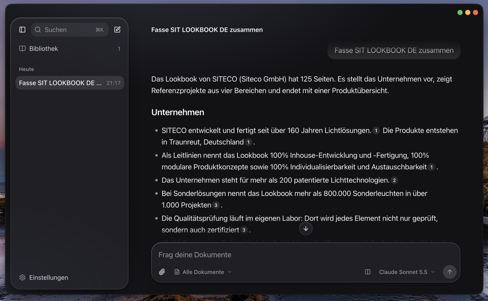

<div align="center">

<picture>
  <source media="(prefers-color-scheme: dark)" srcset="docs/images/banner-dark.svg">
  
</picture>

<br>

[](https://github.com/helpful-luca/Siteco/actions/workflows/ci.yml)


[Getting started](#getting-started) · [Features](#features) · [How it works](#how-it-works) · [Decisions](#key-decisions) · [Tests](#tests) · [Next steps](#next-steps)

</div>

<br>

Upload PDFs and text files, ask questions in German or English, and every answer points to the exact sentence it comes from. Your files stay on your machine; only the question and the relevant passages are sent to Claude.



## Getting started

| | Command | Result |
|---|---|---|
| Docker | `docker compose up --build` | App at http://localhost:3000 |
| Desktop app | `npm install && npm run app` | Same app in its own window |
| Development | `npm install && npm run dev` | Backend and frontend with hot reload |

After the first start, an onboarding asks for language, appearance and your name. Then add your Claude API key under **Settings > Models**. Without a key, upload and search already work and questions return the matching passages.

### Docker

Requires Docker with Compose v2 and about 4 GB of free memory.

```sh
git clone https://github.com/helpful-luca/Siteco.git
cd Siteco
docker compose up --build
```

- The first build takes a few minutes and about 3.5 GB of disk. Later starts take seconds.
- The key can also go into `.env`: `cp .env.example .env`, set `ANTHROPIC_API_KEY`, run `docker compose up -d`.
- Port 3000 taken: `APP_PORT=3001 docker compose up --build`.
- Stop with `docker compose down`. Documents and chats stay in Docker volumes.

### Desktop app

Requires Docker and Node 22.12 or newer.

```sh
npm install
npm run app
```

The app starts Docker Desktop if needed, runs the same stack and opens a window. The first start downloads Electron (about 130 MB). Installers for macOS and Windows: [desktop/README.md](desktop/README.md).

### Development

Requires Python 3.12 with [uv](https://docs.astral.sh/uv/), Node 22.12 or newer, `make` and Docker. Stop the Docker stack first (`docker compose stop`), since both use port 3000.

```sh
npm install
npm run dev
```

Starts the virus scanner in Docker, the backend on port 8000, Next.js on port 3000 and the desktop window. The first run downloads the embedding model (about 400 MB). A key in `.env` is used here as well. For scanned PDFs outside Docker: `brew install tesseract tesseract-lang`.

## Features

<p>
  
  
  
</p>
<p>
  
  
</p>
<p>
  
  
</p>

| Case brief | What is built |
|---|---|
| Upload | PDF, TXT, Markdown, HTML by drag and drop or link; up to 1 GB and 5000 pages per file; ClamAV scan first |
| Process | pypdfium2 in its own process, OCR for scans, sentence-aware chunks, local embeddings (IBM Granite), LanceDB |
| Retrieve | Hybrid search: vectors and BM25 with German stemming, combined by rank fusion |
| Answer | Claude with native citations, streamed, with stop, retry and chat history |
| Rich rendering | Markdown with tables and code; tables and code open in a side panel |
| Citation highlighting | Exact line positions in PDFs, passages in text files, OCR word positions for scans |
| Multiple models | Haiku, Sonnet or Opus per message, plus a side-by-side comparison |

Also included: light and dark mode, command palette (⌘K or Ctrl K), data export and deletion, desktop app for macOS and Windows.

## How it works

```
Browser or desktop window (localhost:3000)
  -> Next.js: UI and a streaming proxy for /api
       -> FastAPI (internal network only)
            SQLite    documents, chats, settings
            LanceDB   chunks, vectors, BM25 index
            files     uploaded originals
       -> ClamAV: scans every upload
  -> Claude API (called by the backend)
```

An upload is scanned, parsed (with OCR where needed), split into sentence-aware chunks and embedded locally. A question runs a hybrid search over these chunks, and the best passages go to Claude, which answers with citations to the exact sentences.

The backend is split into `api`, `services`, `domain` and `adapters`; import-linter checks these boundaries in CI. The frontend uses feature folders, with API types generated from the OpenAPI contract. More in [docs/architecture.md](docs/architecture.md).

## Key decisions

| Area | Choice | Instead of | Reason |
|---|---|---|---|
| Citations | `search_result` blocks with Claude's native citations, mapped back by chunk id | Prompting for `[1]` markers | Claude returns the exact cited span, nothing to parse. Document text stays out of the instructions |
| Search | Vectors plus BM25 with German stemming, merged with reciprocal rank fusion | Vectors only | Vectors miss literal codes like `IP66`, BM25 misses questions in the other language |
| Embeddings | Granite 97M multilingual, ONNX on CPU, baked into the image | API embeddings, bge-m3 | Works offline, handles German well, Apache 2.0, and you only need one API key |
| Storage | SQLite as source of truth, LanceDB embedded as the index | Qdrant, Chroma | No extra service. Search only returns documents SQLite marks as `ready` |
| PDF parsing | pypdfium2 in a separate worker process | PyMuPDF (AGPL), Docling (pulls in torch) | Line rectangles for highlighting; a hanging PDF is killed together with its process |
| Streaming | SSE over POST through an own Next.js route | Vercel AI SDK, Next.js `rewrites()` | `rewrites()` buffered the whole stream; the own route passes it through as it arrives |
| Chunking | About 400 tokens by page, paragraph and sentence, never across pages | Semantic chunking | A sentence is the unit that gets cited, and the page number stays exact for the viewer |
| Default model | Sonnet 5.5 at low effort, Haiku and Opus selectable per message | One fixed model | Good enough for reading comprehension at a fair price; cost is shown per answer |
| Rendering | Markdown without images or raw HTML, static CSP | Sanitising HTML afterwards | A prompt injection has no image URL to leak data through |
| Uploads | Raw body per file, quarantined until ClamAV reports clean | Multipart, scanning later | The size limit is enforced while streaming; unscanned bytes are never served |

All decisions: [docs/decisions.md](docs/decisions.md).

## Tests

```sh
make test   # backend, frontend and desktop tests
make lint   # linters, type checks, architecture boundaries
make e2e    # browser tests against the Docker stack
```

| Area | Tool | Tests |
|---|---|---|
| Backend | pytest with real SQLite and LanceDB | 944 |
| Frontend | Vitest and Testing Library | 491 |
| Desktop app | Vitest | 113 |
| End to end | Playwright against the Docker stack | 2 runs |

Tests replace Claude with a test double, so they never call the paid API. CI runs all of them and builds the Docker images. `make e2e` needs a browser once: `cd frontend && npx playwright install chromium`.

## Configuration

Nothing is required. All options are in [.env.example](.env.example).

| Variable | Default | Purpose |
|---|---|---|
| `ANTHROPIC_API_KEY` | empty | Claude API key; a key set in the app takes precedence |
| `APP_PORT` | `3000` | Port of the web app |
| `OCR` | `on` | Read scanned pages; `off` skips them |
| `LOG_LEVEL` | `INFO` | Backend log level |

## Security and privacy

- The API key stays in the backend, and the backend is not reachable from outside Docker.
- Uploads are checked for size and file type, parsed in a separate process and scanned by ClamAV.
- Documents go to Claude as data, not instructions. Answers cannot load images or run HTML.
- No analytics and no third-party requests.
- Deleting a document removes the file, its vectors and quoted snippets.

Details: [docs/security.md](docs/security.md).

## Next steps

- Hosting as a web service
- User accounts with a private library per user
- More model providers to choose from
- Measured retrieval and answer quality
- A mobile app that syncs across devices
